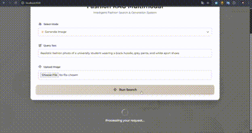

# 👗 Design and Construction of a Multimodal Fashion-RAG System for Intelligent Clothing Recommendation Based on Fashion Product Images and Text Dataset

Sistem rekomendasi fashion cerdas yang menggabungkan pencarian multimodal (teks + gambar), AI text generation, dan pembuatan gambar fashion baru secara otomatis. Dibangun dengan teknologi modern dan model AI state-of-the-art untuk memberikan pengalaman pencarian fashion yang intuitif dan powerful.


---

## 👥 Authors & Contributors

Proyek ini dikembangkan oleh:

| Nama | NIM | Role | GitHub Account |
|------|-----|------|----------------|
| **Muhammad Aunul Hakim** | 202210370311073 | QA & Project Lead | [@aunulhakimm](https://github.com/aunulhakimm) |
| **Rahmatun Nikmah** | 202210370311109 | Frontend / Fullstack Dev | [@rnikmah](https://github.com/rnikmah) |
| **Muhammad Zaky Darajat** | 202210370311052 | ML Engineer (Retrieval) | [@zakydarajat](https://github.com/zakydarajat) |
| **Dio Richard Prastiyo** | 202210370311061 | Data Engineer / Architect | [@dioricharrd](https://github.com/dioricharrd) |
| **Nadhira Ulya Nisa** | 202210370311079 | AI Engineer | [@narpo0207](https://github.com/narpo0207) |

---

## ✨ Fitur Utama

- 🔍 **Pencarian Multimodal**: Cari produk fashion menggunakan gambar, teks, atau kombinasi keduanya
- 🤖 **AI Text Generation**: LLM menghasilkan deskripsi fashion dan rekomendasi personal berbasis konteks pencarian
- 🎨 **AI Image Generation**: Buat variasi gambar fashion baru dengan Stable Diffusion
- ⚡ **Pencarian Cepat**: FAISS untuk vector similarity search dengan performa tinggi
- 🌐 **Web UI Modern**: Antarmuka responsif dengan Tailwind CSS, animasi smooth, dan UX yang intuitif
- 🔄 **REST API**: Backend Flask dengan endpoint terstruktur untuk integrasi mudah

---

## 🏗️ Arsitektur Sistem


**Pipeline Workflow:**
1. **Input**: User memberikan query text, upload image, atau kombinasi keduanya
2. **Encoding**: CLIP mengubah input menjadi vector embedding 512-dimensi
3. **Retrieval**: FAISS mencari top-k items dengan similarity tertinggi
4. **RAG**: LLM menghasilkan rekomendasi berbasis retrieved items
5. **Generation**: (Opsional) Stable Diffusion membuat gambar fashion baru
6. **Output**: Results ditampilkan ke user dengan deskripsi AI

---

## 🚀 Quick Start

### Prasyarat
- Python 3.9 atau lebih tinggi
- RAM minimal 8GB (direkomendasikan 16GB)
- GPU (opsional, untuk image generation lebih cepat)
- API key untuk LLM (jika menggunakan Gradio/Colab endpoint)

### Instalasi

#### 1. Clone Repository
```bash
git clone <repository-url>
cd project-fashion-rag-generative-ai
```

#### 2. Setup Backend

**Windows (PowerShell):**
```powershell
cd backend
python -m venv .venv
.\.venv\Scripts\Activate.ps1
pip install --upgrade pip
pip install -r requirements.txt
```

**Linux/Mac:**
```bash
cd backend
python3 -m venv .venv
source .venv/bin/activate
pip install --upgrade pip
pip install -r requirements.txt
```

#### 3. Setup Environment Variables (Opsional)

Jika menggunakan Gradio endpoint untuk LLM dan Stable Diffusion:
```bash
# Buat file .env di folder backend
LLAMA_URL=https://your-gradio-llm-url.gradio.live
SD_URL=https://your-gradio-sd-url.gradio.live
```

#### 4. Jalankan Backend
```bash
python app.py
```

Backend akan berjalan di `http://127.0.0.1:5000`

#### 5. Setup Frontend

Buka terminal baru:

**Windows (PowerShell):**
```powershell
cd frontend
python -m http.server 8000
```

**Linux/Mac:**
```bash
cd frontend
python3 -m http.server 8000
```

Buka browser dan akses: `http://localhost:8000`

### Cara Cepat (Tanpa Virtual Environment)
```bash
cd backend
pip install flask flask-cors faiss-cpu numpy pillow torch transformers python-multipart
python app.py
```

---

## 💻 Penggunaan

> 🎥 **Demo Simulasi Penggunaan Sistem**
> 
> [📺 Lihat video demo lengkap di Google Drive](https://drive.google.com/file/d/1KFNRRL0G7AktcTAV8tg7_pPmM-SPbJQi/view?usp=sharing)



### Option 1: Web UI (Recommended)

1. **Buka browser** dan akses `http://localhost:8000`

2. **Pilih mode pencarian:**
   - **🔍 Search by Text**: Masukkan deskripsi fashion (e.g., "black dress for party")
   - **🖼️ Search by Image**: Upload gambar fashion untuk mencari produk serupa
   - **🔄 Multimodal Search**: Kombinasi text + image untuk hasil lebih presisi
   - **💡 RAG Recommendation**: Dapatkan rekomendasi fashion berbasis AI
   - **✨ Generate Image**: Buat gambar fashion baru dari deskripsi text

3. **Input query:**
   - Ketik deskripsi di field "Query Text"
   - Upload gambar (jika menggunakan image/multimodal mode)

4. **Klik "Run Search"** dan tunggu hasil

5. **Lihat hasil:**
   - Grid produk fashion dengan similarity score
   - Deskripsi & rekomendasi AI (mode RAG)
   - Generated image (mode generate)

### Option 2: Python API

```python
import requests

API_URL = "http://127.0.0.1:5000"

# Search by text
response = requests.post(f"{API_URL}/search/text", 
                        json={"query": "summer casual dress"})
results = response.json()
print(results)

# Search by image
with open("fashion_image.jpg", "rb") as f:
    files = {"image": f}
    response = requests.post(f"{API_URL}/search/image", files=files)
    results = response.json()

# Multimodal search
with open("fashion_image.jpg", "rb") as f:
    data = {"query": "elegant evening dress"}
    files = {"image": f}
    response = requests.post(f"{API_URL}/search/multimodal", 
                            data=data, files=files)

# RAG recommendation
response = requests.post(f"{API_URL}/rag/recommend",
                        json={"query": "office casual", "items": []})
recommendation = response.json()["recommendation"]

# Generate image
response = requests.post(f"{API_URL}/generate/image",
                        json={"prompt": "modern minimalist white dress"})
image_data = response.json()
```

---

## 📁 Struktur Proyek

```
project-fashion-rag-generative-ai/
├── backend/                        # Flask REST API
│   ├── app.py                     # Main Flask application
│   ├── clip_encoder.py            # CLIP text/image encoder
│   ├── retriever.py               # FAISS vector search
│   ├── requirements.txt           # Python dependencies
│   ├── rag/                       # RAG components
│   │   ├── __init__.py
│   │   └── llama_client.py        # LLM client (Gradio)
│   ├── services/                  # External services
│   │   └── sd_client.py           # Stable Diffusion client
│   └── data/                      # Data storage
│       ├── index.faiss            # FAISS index file
│       ├── metadata.json          # Product metadata
│       ├── images/                # Fashion product images
│       └── generated/             # AI-generated images
│
├── frontend/                       # Web UI
│   ├── index.html                 # Main HTML page
│   ├── css/
│   │   └── styles.css             # Custom styles
│   ├── js/
│   │   ├── app.js                 # Main application logic
│   │   └── components.js          # UI components
│   └── assets/                    # Static assets
│       └── logo.jpg               # Logo image
│
├── colab/                          # Jupyter notebooks
│   └── [notebook files]           # Data preprocessing & indexing
│
└── README.md                       # Documentation (this file)
```

---

## 📊 API Endpoints

> 📖 **Dokumentasi API Lengkap**: [Postman Documentation](https://documenter.getpostman.com/view/51115010/2sBXVbGtM6)

### 1. Search by Text
```http
POST /search/text
Content-Type: application/json

{
  "query": "black casual dress"
}
```

**Response:**
```json
[
  {
    "id": "12345",
    "name": "Black Casual Dress",
    "image": "/images/12345.jpg",
    "score": 0.89,
    "description": "..."
  }
]
```

### 2. Search by Image
```http
POST /search/image
Content-Type: multipart/form-data

image: <file>
```

### 3. Multimodal Search
```http
POST /search/multimodal
Content-Type: multipart/form-data

query: "elegant dress"
image: <file>
```

### 4. RAG Recommendation
```http
POST /rag/recommend
Content-Type: application/json

{
  "query": "summer outfit for beach",
  "items": []
}
```

**Response:**
```json
{
  "query": "summer outfit for beach",
  "recommendation": "Based on your query, I recommend..."
}
```

### 5. Generate Image
```http
POST /generate/image
Content-Type: application/json

{
  "prompt": "modern white minimalist dress"
}
```

### 6. Serve Images
```http
GET /images/<filename>
GET /generated/<filename>
```

---

## 🎨 Web UI Features

- **Mode Dinamis**: Switch antara text, image, multimodal, RAG, dan generate mode
- **Responsive Design**: Optimal di desktop, tablet, dan mobile
- **Loading States**: Spinner animasi saat processing request
- **Error Handling**: Pesan error yang user-friendly
- **Result Grid**: Tampilan hasil pencarian dalam grid responsif
- **Image Preview**: Preview image sebelum upload
- **Smooth Animations**: Entrance animations dan transitions

---

## 🔧 Konfigurasi

### Environment Variables

Buat file `.env` di folder `backend/`:

```env
# LLM API (Gradio Endpoint)
LLAMA_URL=https://your-colab-llm-url.gradio.live

# Stable Diffusion API (Gradio Endpoint)
SD_URL=https://your-colab-sd-url.gradio.live

# CLIP Model
CLIP_MODEL=openai/clip-vit-base-patch32

# Search Configuration
TOP_K=5
```

### Dependencies

**Backend** (`backend/requirements.txt`):
```
flask
flask-cors
faiss-cpu
numpy
pillow
torch
transformers
python-multipart
gradio-client  # Untuk LLM & SD endpoints
```

### Data Files

Data besar **tidak disarankan** di-commit ke Git. Gunakan salah satu opsi:
1. **Git LFS** untuk file besar
2. **External storage** (Google Drive, S3, dll)
3. **Re-generate** index menggunakan notebook Colab

**Struktur data yang dibutuhkan:**
```
backend/data/
├── index.faiss         # Vector index (~10MB untuk 1000 items)
├── metadata.json       # Product info (~1MB)
└── images/            # Product images (~500MB - 2GB)
    ├── 001.jpg
    ├── 002.jpg
    └── ...
```

---

## 🧪 Testing

### Test Backend Endpoints

```bash
# Test text search
curl -X POST http://localhost:5000/search/text \
  -H "Content-Type: application/json" \
  -d '{"query": "black dress"}'

# Test image search
curl -X POST http://localhost:5000/search/image \
  -F "image=@test_image.jpg"

# Test RAG
curl -X POST http://localhost:5000/rag/recommend \
  -H "Content-Type: application/json" \
  -d '{"query": "summer outfit", "items": []}'
```

### Test CLIP Encoder

```python
from clip_encoder import encode_text, encode_image
from PIL import Image

# Test text encoding
text_emb = encode_text("black dress")
print(text_emb.shape)  # (1, 512)

# Test image encoding
img = Image.open("test.jpg")
img_emb = encode_image(img)
print(img_emb.shape)  # (1, 512)
```

### Test FAISS Retriever

```python
from retriever import search
import numpy as np

# Test with dummy embedding
dummy_emb = np.random.randn(1, 512).astype('float32')
results = search(dummy_emb, k=5)
print(f"Found {len(results)} results")
```

---

## 🐛 Troubleshooting

### Backend tidak bisa start
```bash
# Cek dependencies
pip install -r requirements.txt

# Cek port availability
netstat -ano | findstr :5000  # Windows
lsof -i :5000                 # Linux/Mac
```

### CORS errors di browser
- Pastikan `flask-cors` terinstall
- Cek konfigurasi CORS di `app.py`

### Images tidak muncul
- Verify dataset sudah di-download
- Cek path di `metadata.json` sudah benar
- Pastikan folder `data/images/` ada dan berisi file gambar

### FAISS index error
```bash
# Re-generate index menggunakan Colab notebook
# Atau download index dari link yang disediakan
```

### API LLM/SD tidak respond
- Cek Gradio endpoint masih aktif
- Verify URL di file `.env`
- Colab session mungkin sudah expired (restart notebook)

### Memory error
- Kurangi batch size saat generate embeddings
- Gunakan `faiss-cpu` bukan `faiss-gpu` jika RAM terbatas
- Close aplikasi lain yang consume memory

---

## 🌐 Deployment

### Development Mode
```bash
python backend/app.py
# Default: debug=True, port=5000
```

### Production Mode

#### Option 1: Gunicorn
```bash
pip install gunicorn
gunicorn -w 4 -b 0.0.0.0:5000 backend.app:app
```

#### Option 2: Docker
```dockerfile
FROM python:3.9-slim
WORKDIR /app
COPY backend/ .
RUN pip install --no-cache-dir -r requirements.txt
EXPOSE 5000
CMD ["python", "app.py"]
```

Build dan run:
```bash
docker build -t fashion-rag .
docker run -p 5000:5000 fashion-rag
```

#### Option 3: Cloud Platforms
- **Heroku**: Deploy dengan Procfile
- **Railway**: Auto-detect Python project
- **Render**: Gunakan render.yaml
- **Google Cloud Run**: Deploy sebagai container

---

## 📚 Technology Stack

### Backend
- **Flask**: Web framework untuk REST API
- **CLIP (OpenAI)**: Multimodal encoder untuk text & image
- **FAISS (Facebook AI)**: Efficient vector similarity search
- **PyTorch**: Deep learning framework
- **Transformers (HuggingFace)**: Pre-trained model loading
- **Gradio Client**: Komunikasi dengan LLM & SD endpoints

### Frontend
- **HTML5/CSS3/JavaScript**: Core web technologies
- **Tailwind CSS**: Utility-first CSS framework
- **Fetch API**: Asynchronous HTTP requests
- **ES6 Modules**: Modern JavaScript modules

### AI Models
- **CLIP ViT-B/32**: Text-image embedding model ([HuggingFace](https://huggingface.co/sentence-transformers/clip-ViT-B-32))
- **TinyLlama 1.1B Chat**: Text generation untuk rekomendasi fashion ([HuggingFace](https://huggingface.co/TinyLlama/TinyLlama-1.1B-Chat-v1.0))
- **Stable Diffusion v1.5**: AI image generation untuk fashion ([HuggingFace](https://huggingface.co/stable-diffusion-v1-5/stable-diffusion-v1-5))

---


## �📄 Lisensi & Kredit

### Lisensi
Proyek ini menggunakan lisensi MIT. Silakan cek file `LICENSE` untuk detail lengkap.

### Acknowledgments

**Datasets:**
- Fashion Product Dataset dari Kaggle (lihat lampiran)

**Models & Frameworks:**
- **CLIP**: OpenAI
- **FAISS**: Facebook AI Research
- **Stable Diffusion**: Stability AI
- **Transformers**: HuggingFace

**Libraries:**
- Flask, PyTorch, NumPy, Pillow
- Tailwind CSS untuk UI design

---

## 🙏 Kontribusi

Kontribusi sangat welcome! Silakan:
1. Fork repository ini
2. Buat feature branch (`git checkout -b feature/AmazingFeature`)
3. Commit changes (`git commit -m 'Add some AmazingFeature'`)
4. Push ke branch (`git push origin feature/AmazingFeature`)
5. Buat Pull Request

---

## 📞 Support & Contact

Untuk pertanyaan, issues, atau feedback:
- Buka issue di GitHub repository
- Cek dokumentasi lengkap di folder `Documentation/`
- Review troubleshooting section di atas

---

## 🔗 Lampiran & Link Penting

### Demo & Tutorial
- **Video Demo Sistem**: [Simulasi Penggunaan Fashion RAG](https://drive.google.com/file/d/1KFNRRL0G7AktcTAV8tg7_pPmM-SPbJQi/view?usp=sharing)

### Dataset & Notebooks
- **Notebook Colab** (Data preprocessing & indexing): [Google Colab Link](https://colab.research.google.com/drive/1WwMVobRyyxsA3R1EdH6C-IYwzVWeZy0t?usp=sharing)
- **Fashion Product Dataset** (Kaggle): [Dataset Link](https://www.kaggle.com/datasets/nirmalsankalana/fashion-product-text-images-dataset)

### Model Resources
- **CLIP ViT-B/32**: [HuggingFace Model](https://huggingface.co/sentence-transformers/clip-ViT-B-32) | [OpenAI CLIP](https://github.com/openai/CLIP)
- **TinyLlama 1.1B Chat**: [HuggingFace Model](https://huggingface.co/TinyLlama/TinyLlama-1.1B-Chat-v1.0)
- **Stable Diffusion v1.5**: [HuggingFace Model](https://huggingface.co/stable-diffusion-v1-5/stable-diffusion-v1-5)
- **FAISS Documentation**: [Facebook FAISS](https://github.com/facebookresearch/faiss)
- **Stable Diffusion (General)**: [Stability AI](https://github.com/Stability-AI/stablediffusion)

### Documentation
- **API Documentation (Postman)**: [View Full API Docs](https://documenter.getpostman.com/view/51115010/2sBXVbGtM6)
- Setup lengkap LLM (Gradio): Lihat notebook Colab
- Generate FAISS index: Lihat folder `colab/`
- API Endpoints Reference: Lihat section "API Endpoints" di atas

---

## 🎯 Roadmap

- [ ] Add user authentication & personalization
- [ ] Implement search history & favorites
- [ ] Add more fashion attributes (color, style, occasion)
- [ ] Fine-tune CLIP on fashion-specific dataset
- [ ] Add recommendation system based on user preferences
- [ ] Mobile app development
- [ ] Real-time image generation feedback

---

**⭐ Jika proyek ini bermanfaat, jangan lupa berikan star di GitHub!**

